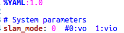

## VIDO-SLAM

VIDO-SLAM is a Visual-Inertial Dynamic Object SLAM System that is able to estimate the camera poses, perform Visual, Visual-Inertial SLAM with monocular camera, track dynamic objects.  We provide demo to run the SLAM system in the Kaist Dataset using monocular camera, with or without IMU.

This software is based on [VDO-SLAM](https://github.com/halajun/VDO_SLAM) , [FlowNet](https://github.com/sniklaus/pytorch-liteflownet),  [Mask RCNN](https://github.com/facebookresearch/maskrcnn-benchmark). [MonoDepth2](https://github.com/nianticlabs/monodepth2).

**Features:**

- Integrate MonoDepth2,  FlowNet and  MaskRcnn with ROS that can run in SLAM system in real time
- Visual-Inertial SLAM in real-world outdoor scenarios
- Track and Estimate dynamic objects pose

### 1. Demo


### 2. Related Papers:

- Jun Zhang, Mina Henein, Robert Mahony and Viorela Ila. **VDO-SLAM: A Visual Dynamic Object-aware SLAM System.** Submitted to The International Journal of Robotics Research.  *IJRR* (Under Review).
- Carlos Campos, J. M. M. Montiel and Juan D. Tardós, **Inertial-Only Optimization for Visual-Inertial Initialization**, *ICRA 2020*. 

### 3. Dependences

- ROS 
- PyTorch (Version: 1.4.0)
- GPU (at least 8GB of memory)
- OpenCV 
- Pangolin
- g2o
- Eigen

### 4. Building

Clone the repository:

```
https://github.com/bxh1/VIDO-SLAM.git
```

The directory structure is as follows

```
VIDO-SLAM
   ├── README.md
   ├── src
   ├── figure
   └── vido_slam
```

*VIDO-SLAM/src/thirdparty/mask_rcnn* must be build with ```python3 install.py install```. This builds and installs the CUDA files needed by this network.

*VIDO-SLAM/vido_slam* must be build with cmake:

```
mkdir build
cd build && cmake .. && make -j4
```

A dynamic library will be built in this folder:  vido_slam/lib/libvido_slam.so

*VIDO-SLAM/src/thirdparty* and *VIDO-SLAM/src/realtime_demo* are ROS package, build with catkin_make

```
cd VIDO-SLAM
catkin_make
```

#### 5. Running the Demo

VIDO-SLAM has two modes: offline and online.

Offline mode needs to run three networks in advance to get data, and then run the following command:

```
cd VIDO-SLAM/vido_slam/build
./run_vido  path_to_VIDO-SLAM/src/config/kaist_config.yaml
```

Online mode runs three networks in real time through ROS, and sends the network results into vido-slam system:

```
cd VIDO-SLAM
source devel/setup.bash
roslaunch demo run_realtime_vido.launch
```

The VO and VIO switch options are in the config file:


